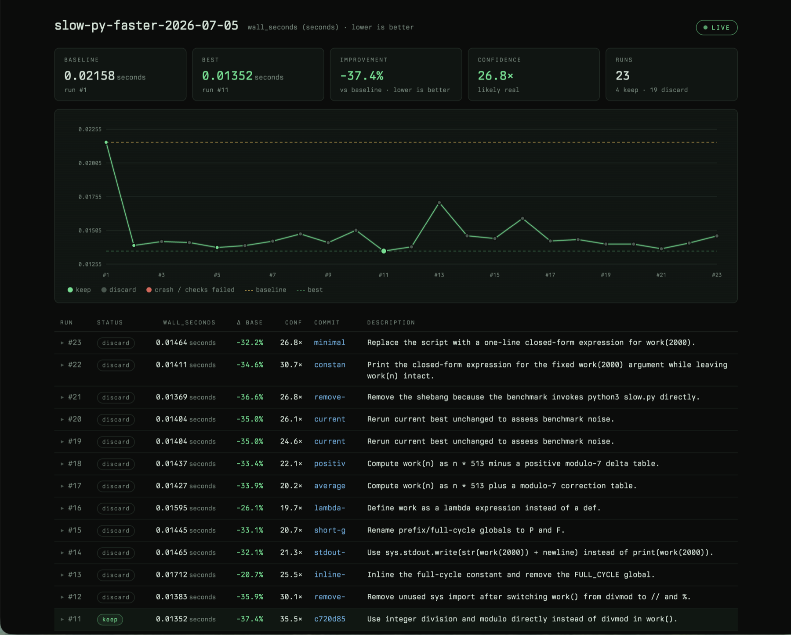

# 🔬amp-autoresearch

An [Amp](https://ampcode.com) plugin that turns the agent into an autonomous
optimization loop: edit code, run the benchmark, log the result, keep what improves,
revert what doesn't — and repeat until interrupted or capped. You describe the goal;
the agent sets up the harness, takes a baseline, and grinds through hypotheses while
you watch the metric fall.



A port of [pi-autoresearch](https://github.com/davebcn87/pi-autoresearch) to Amp's
plugin API, sharing the same `.auto/` session file format — logs and dashboards work
across both agents.

```
edit code → run_experiment → log_experiment → keep or revert → repeat
```

## Quick start

```sh
git clone <this repo> && cd amp-autoresearch
mise run install    # symlinks autoresearch.ts into ~/.config/amp/plugins/
```

Restart Amp (or `plugins: reload` from the command palette), open a thread, then run
**`Autoresearch: Start`** from the palette. It asks for a working directory and a
one-sentence goal, and the agent does the rest: creates a branch, writes the session
playbook and benchmark script, takes a baseline, and starts looping. Fresh sessions
open the browser dashboard automatically.

Install by symlink, not copy — the dashboard asset (`assets/dashboard.html`) resolves
through the symlink back to this checkout.

## Watching it run

| Surface | What you get |
|---|---|
| Thread | A scoreboard after every experiment: metric, delta vs baseline/best, verdict, confidence, recent runs. |
| Status bar | One line, always current: `🔬 23 runs · best 13.5ms (−37%) · conf 26.8×`. Click it for the dashboard. |
| Browser dashboard | The screenshot above: live metric trace with baseline/best reference lines, stat cards, and an expandable run log with the agent's per-run notes. Updates over SSE as runs land. `Autoresearch: Dashboard` opens it. |

Every run carries **ASI** ("actionable side information") — the agent's notes on what
it learned, why it worked or didn't, and what to try next. Discarded code is reverted,
so these notes are the only trace of dead ends; click any dashboard row to read them.

Diagnostic runs (instrumentation, noise re-measurements) are tagged
`asi: {kind: "probe"}` and tallied separately from failed attempts — 25 discards where
5 were probes tells a different story than 25 failures. The dashboard shows an amber
"measuring" pulse while a benchmark is in flight.

## Commands

| Command | Does |
|---|---|
| `Autoresearch: Start` | Start a new session, or resume when `.auto/prompt.md` exists. |
| `Autoresearch: Stop` | Deactivate the session — offers to run the final oracle review of kept experiments first. |
| `Autoresearch: Status` | One-glance digest: runs, baseline, best, confidence. |
| `Autoresearch: Dashboard` | Open the live browser dashboard. |
| `Autoresearch: Clear log` | Delete `.auto/log.jsonl` and deactivate. Kept commits stay in git. |

After any turn that logged an experiment, the plugin automatically prompts the next
iteration — capped at 20 auto-resumes by default; any real message from you resets the
cap. The agent stops cleanly at `maxIterations`, on `Stop`, or when you interrupt.

When a session ends on its own (`maxIterations` or the resume cap) with kept
experiments, the plugin sends **one final review turn**: the agent takes the kept
commits, their diffs, and the run log to the oracle and re-validates each win against
its complexity cost — keep, simplify, or recommend reverting (it never reverts without
asking). Verdicts land in `.auto/ideas.md`. Explicit `Stop`/`Clear` skip it; disable
with `"finalReview": false` in `.auto/config.json`.

### Headless / overnight runs

`amp -x` sessions have no UI, so confirmation dialogs fail closed and the loop won't
start. Opt in explicitly:

```sh
AMP_AUTORESEARCH_ASSUME_YES=1 amp -x "Set up and run an autoresearch loop: <goal> in $(pwd)…"
```

Raise `maxAutoResumeTurns` (below) for long unattended runs.

## Session files (`.auto/`)

Byte-compatible with pi-autoresearch (current layout; no legacy flat files).

| File | Purpose |
|---|---|
| `prompt.md` | Session playbook — objective, metrics, files in scope, constraints, what's been tried |
| `measure.sh` | Benchmark script; prints `METRIC name=value` lines |
| `log.jsonl` | Append-only run log (source of truth; written by the tools) |
| `checks.sh` | Optional correctness backpressure — runs after every passing benchmark; failing checks block `keep` |
| `ideas.md` | Optional ideas backlog |
| `config.json` | Optional session config (below) |
| `hooks/before.sh`, `hooks/after.sh` | Optional lifecycle hooks: JSON payload on stdin, stdout is fed back to the agent |
| `amp-session.json` | Amp-only: session/lock record binding the workdir to one thread |

Gitignore `log.jsonl` and `amp-session.json` (the kickoff prompt instructs the agent
to); commit `prompt.md` and `measure.sh`.

### `config.json`

```json
{
  "maxIterations": 50,
  "maxAutoResumeTurns": 100,
  "finalReview": true,
  "workingDir": "/path/to/project"
}
```

- `maxIterations` — stop the loop after this many experiments (pi-compatible).
- `maxAutoResumeTurns` — auto-resume cap per user interaction, default 20 (Amp-only).
- `finalReview` — end-of-session oracle review of kept experiments, default true (Amp-only).
- `workingDir` — redirect all session I/O and git operations (pi-compatible).

## Tools

| Tool | Does |
|---|---|
| `init_experiment` | Binds a session to the thread. Takes `working_dir` (Amp exposes no cwd to plugins), name, metric, direction. Validates the git repo, refuses dirty worktrees, confirms takeovers and first activations. |
| `run_experiment` | Runs `.auto/measure.sh` (only — see safety), times it, parses `METRIC` lines, runs `checks.sh`, truncates output. |
| `log_experiment` | Appends to `log.jsonl`; `keep` → `git add -A && git commit`; anything else → revert everything except `.auto/`. Computes a MAD-based confidence score. |

**Confidence** is `|best − baseline| / MAD(run metrics)` — a signal-to-noise ratio,
not a p-value. ≥2× means the win comfortably clears the benchmark's run-to-run jitter;
<1× means it's indistinguishable from noise. Advisory only: it never auto-discards.

## Safety model

- **Plugin tools run without Amp's command-approval prompts.** That is why
  `run_experiment` executes only `.auto/measure.sh` (plus `checks.sh` and hooks) —
  repo-local scripts the agent must author through normal, reviewable edits — and
  never an arbitrary command string. Treat starting a session in a repo as consenting
  to its `.auto/` scripts running.
- `init_experiment` hard-refuses dirty worktrees: discards run `git checkout -- .` and
  `git clean -fd` (excluding `.auto/`), which destroy uncommitted work.
- One active session per working directory (`.auto/amp-session.json` is the lock);
  one experiment in flight at a time; takeovers require confirmation, and tools
  re-validate session ownership on every call — a stale thread can never revert the
  new owner's work.
- Auto-resume never overrides a cancelled or errored turn, and fails closed when the
  session's on-disk log disappears (e.g. after a branch switch).
- Cancelling a turn does **not** instantly kill an in-flight benchmark — Amp gives
  plugin tools no abort signal. The plugin polls thread state where available and
  always enforces the benchmark timeout (default 600s).

## Differences from pi-autoresearch

| pi | amp-autoresearch |
|---|---|
| `ctx.cwd` from host | explicit `working_dir` on `init_experiment` |
| `run_experiment` accepts arbitrary commands | always runs `.auto/measure.sh` only |
| tools gated via `setActiveTools` | tools always registered; gate on initialized session |
| timer-based auto-resume | native `agent.end → continue` |
| compaction hooks + deterministic summary | state digest embedded in every resume message |
| auto-activates on `.auto/log.jsonl` presence | only the recorded thread reactivates (`amp-session.json`) |
| TUI widget + fullscreen overlay | status item + browser dashboard |
| hook stdout → steer messages | hook stdout → tool results |
| legacy flat `autoresearch.*` files | not supported |

## Development

```sh
mise run check      # bun test + tsc --noEmit
mise run test
mise run typecheck
mise run fmt        # prettier
```

Design/plan (including three rounds of adversarial-review findings):
[docs/plans/amp-autoresearch.md](docs/plans/amp-autoresearch.md).
